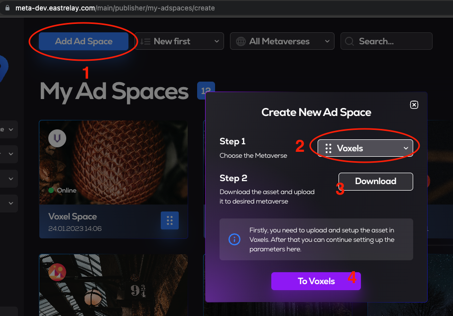
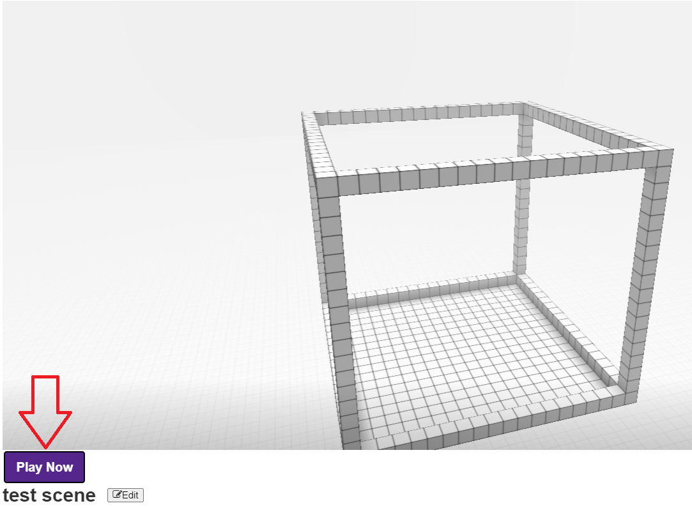

# MetaAds Voxel's Scene

## Introduction
This document is an instruction on how to create a scene for Voxel.
## 1. Opening the MetaAds website
* Connect
* Click on Landowner
* Click on My Ad Spaces
## 2. Going to Voxels

* Click on Add Ad Space
* Choose Voxel metaverse
* Click on Download
    * Save file on PC
* Click on To Voxels button
## 3. Connecting with MetaMask

* Click on Sign In
* Click on MetaMask
	* Click on Next
	* Click on Connect
	* Click on Sign
## 4. Registration and signing

* Enter Name
* Click on Register name
* On MetaMask click on Sign 
## 5. Creating a space

* Click on Spaces
* Click on Create a free space
## 6. Name of the scene
  
* Enter Name
* Click on Create  
## 7. 

* Click on Visit

* Click on Cubes icon
* Click on Browse Asset Library
* Click on Meta Ads asset (if not listed, enter the name in the search)
* Click on Add to parcel

* Position the object on the land

* Paste downloaded script to Script field

* If the red circle next to the Expand button doesn't turn green, reload the page (if the circle turns green, close this form)
"Click to register ad space" text is displayed on screen
* Click on Screen

* Click on Open
* Click on OK

* Enter name
* Enter description
* Upload picture
* Click on Save
<u>EXPECTED STATE</u>: Voxel ad space displayed in list
You can start campaigns. Available for voxel - picture creatives, video creatives, YouTube stream, twitch stream.
