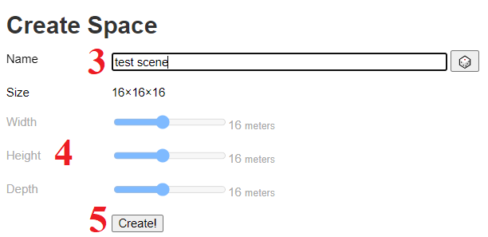
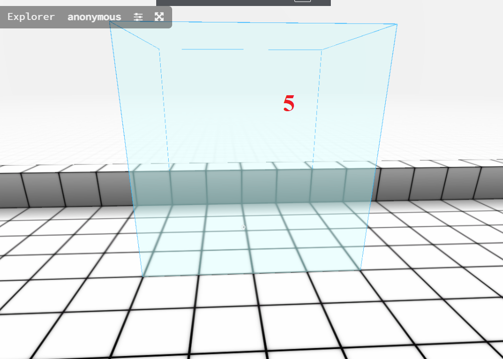

# MetaAds Voxel's Scene

## Introduction

 This document is an instruction on how to create a scene for *Voxels*.

## 1. Opening the [**MetaAds**](https://metaads.team/main/) website

* Connect
* Click on *Landowner*
* Click on *My Ad Spaces*

## 2. Going to [*Voxels*](https://www.voxels.com/?ref=)

* Click on Add Ad Space

##

* Click on Select Metaverse (1)
* Choose *Voxels* metaverse (2)

##

* Click on Download and save file on PC (3)
* Click on To *Voxels* button

## 3. Connecting to *Voxels*

* Click on Log In
* Select a wallet and log in

## 4. Creating a space

* Click on Spaces (1)
* Click on Create a space (2)

##

* Enter Name (3)
* Choose a size of scene (4)
* Click on Create (5) 

 

## 5. Adding the **Meta Ads** asset

* Click on Add (1)
* Click on Browse Asset Library (2)
* Click on **Meta Ads** asset (if not listed, enter the name in the search) (3)
* Click on Add to Parcel (4)

##

* Position the object on the land (5)

 
##

* Click on *Advanced* 
* Insert downloaded script to Script field (6)

> If the red circle next to the Expand button doesn't turn green, reload the page (if the circle has turned green, close this form).

## 6. Completing the creation of the scene

* Click on **Meta Ads** Screen
* Click on external link

##

> "Create New Ad Space" pop up on **Meta Ads** website will be open

* Enter *Name* (1)
* Enter *External target link* (is optional) (2)
* Enter *Description* (3)
* Enter *jump URL* (is optional) (4)
* Upload *Preview Image* (This is the image that will be displayed on the site with the created Ad Space)(5)
* You can choose to enable *moderation* or not (is optional)
* Click on Save

> In the last step, enter *Cost per minute* on your *Ad Space*.

> EXPECTED STATE: The created *Voxels* **Ad Space**  will appear on the *My Ad Spaces* tab. You can start campaigns. Available for *Voxels* - image creatives, video creatives, **YouTube** and **Twitch** streams.

