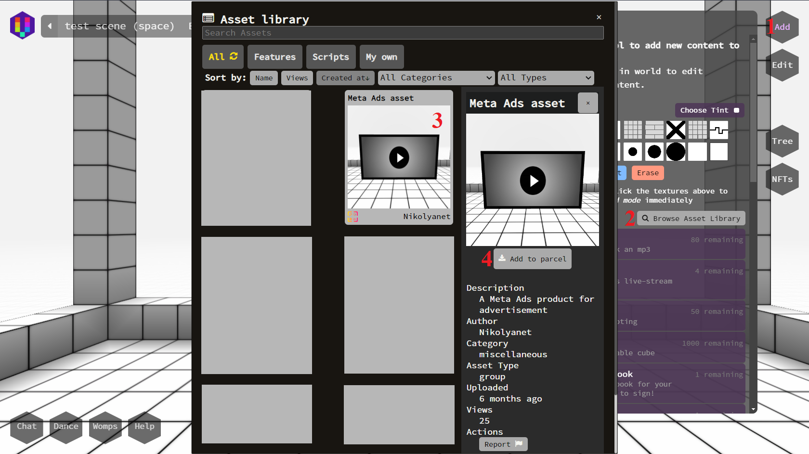
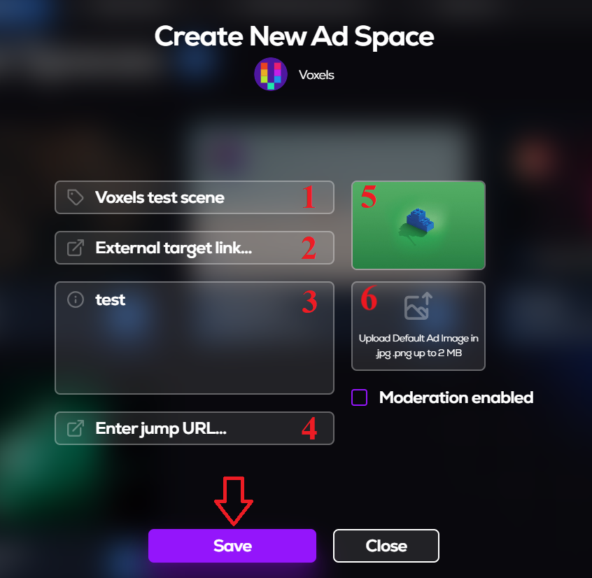
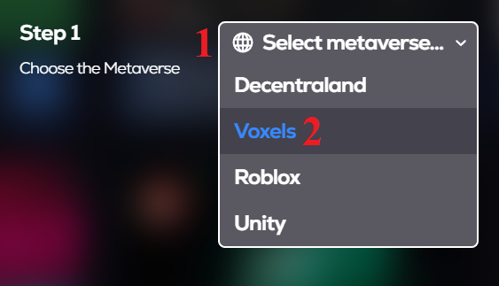

# voxels-tutorial

\
Connect\
Click on Landowner\
Click on My Ad Spaces

1. Click on Add Ad Space
2. Choose Voxel metaverse
3. Click on Download\
    3.1.Save file on PC
4. Click on To Voxels button\

5. Click on Sign In
6. Click on MetaMask\
	6.1 Click on Next\
	6.2 Click on Connect\
	6.3 Click on Sign\

7. Enter Name
8. Click on Register name
9. On MetaMask click on Sign  

10. Click on Spaces
11. Click on Create a free space
  
12. Enter Name
13. Click on Create  

14. Click on Visit

15. Click on Cubes icon
16. Click on Browse Asset Library
17. Click on Meta Ads asset (if not listed, enter the name in the search)
18. Click on Add to parcel

19. Position the object on the land

20. Paste downloaded script to Script field

21. If the red circle next to the Expand button doesn't turn green, reload the page (if the circle turns green, close this form)
"Click to register ad space" text is displayed on screen
22. Click on Screen

23. Click on Open
24. Click on OK

25. Enter name
26. Enter description
27. Upload picture
28. Click on Save\
<u>EXPECTED STATE</u>: Voxel ad space displayed in list
You can start campaigns. Available for voxel - picture creatives, video creatives, YouTube stream, twitch stream.
